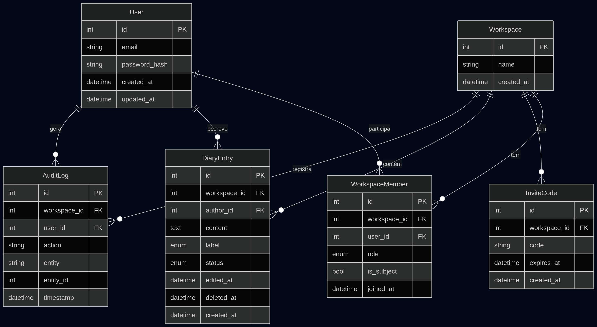
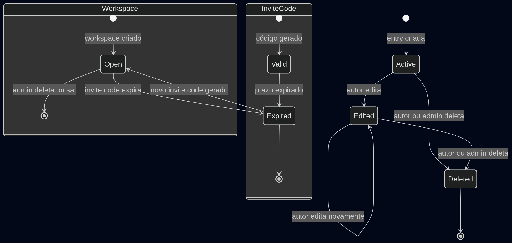
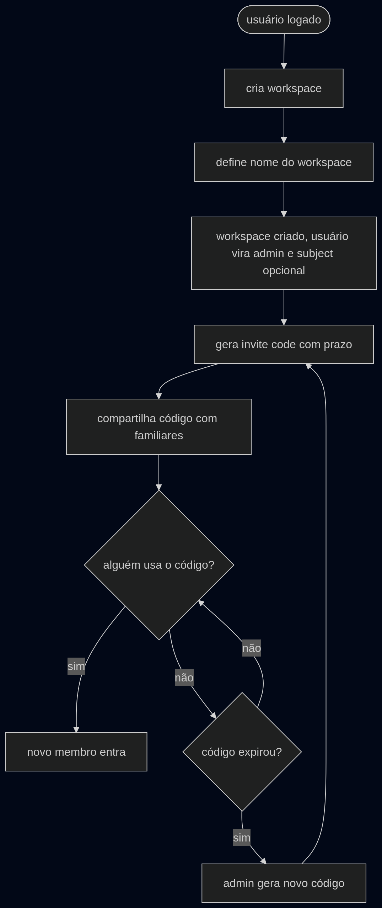
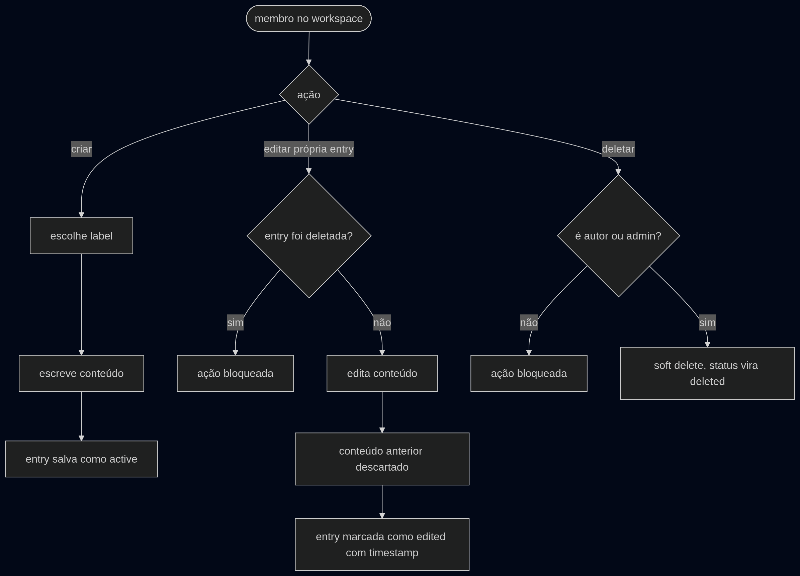

# Elo de Cuidado

## Visão geral
Elo de Cuidado é uma aplicação de diário de saúde compartilhado, voltada primariamente pra famílias que acompanham a saúde de idosos, e, alternativamente para indivíduos que desejam registrar a própria saúde.

A proposta é: um workspace representa um núcleo de cuidado com um sujeito (a pessoa acompanhada) e membros que registram observações ao longo do tempo.

---

## Stack

| Camada         | Tecnologia       |
| -------------- | ---------------- |
| Frontend       | React            |
| Backend        | ASP.NET          |
| Banco de dados | MariaDB          |
| ORM            | Entity Framework |
| Infraestrutura | Docker           |
| Geração de PDF | Typst            |

---

## Decisões de arquitetura

### Workspace isolado
Cada workspace é independente. Um usuário que deseja participar de múltiplos contextos (ex: acompanhar um familiar e manter diário próprio) cria workspaces separados com a mesma conta.

### Sujeito como membro
O sujeito do workspace (o acompanhado) não é uma entidade separada, é um `WorkspaceMember` com a flag `is_subject`. Isso possibilita que o sujeito possa criar suas próprias notas e participar de múltiplos workspaces (ex: acomapnhar um familiar e manter um diário próprio).

### Soft delete
Entries deletadas não sao removidas do banco, recebem o status `deleted` e timestamp.

### Recuperação de senha
Apenas admins possuem  fluxo de recuperação de senha via email. Membros comuns têm a senha redefinida pelo admin.

### Convite por código
Membros entram no workspace via invite code multi-use com prazo de expiração.

---

## Confirmidade com a LGPD

O sistema implementa os seguintes mecanismos:

- **Rastreabilidade**: toda ação sensível é registrada na tabela `AuditLog` com usuário, entidade afetada e timestamp.
- **Direito ao esquecimento**: O sistema suporta deleção completa de dados de um usuário sob solicitação.

---

## Modelagem do banco de dados

### Diagrama ER

### Entidades

**User**
Representa uma conta do sistema. Um usuário pode participar de múltiplos workspaces com roles distintas.

**Workspace**
Núcleo de cuidado. Possui exatamente um admin e exatamente um sujeito. Ao ser deletado ou o admin sair, todos os dados associados são removidos.

**WorkspaceMember**
Relação entre usuário e workspace. Armazena role (`admin` ou `member`) e flag `is_subject`. Um mesmo usuário pode ter memberships em múltiplos workspaces com configurações distintas.

**InviteCode**
Código de convite multi-use associado a um workspace, com prazo de expiração. O admin pode gerar novo código após expiração.

**DiaryEntry**
Registro feito por um membro sobre o sujeito do workspace. Possui label pré-definida, status (`active`, `edited`, `deleted`). Edições substituem o conteúdo anterior sem histórico de versões.

**AuditLog**
Registro de ações sensíveis para conformidade com a LGPD. Armazena usuário, ação realizada, entidade afetada e timestamp.

---

## Fluxos do sistema

### Estados

### Cadastro e login

### Criar workspace e convidar membros

### Entrar em workspace via código

### Gerenciamento de entries

### Geração de PDF

---

## Diagrama de classes

(todo, quando o banco estiver pronto)

---

_versão 0.1.0_